name: titleslide
class: center, middle

# GIT en GitHub voor GEO

Rob van Loon

@rob_vl // http://github.com/borrob

---

# Inhoud

- Wie ?
- Wat ?
- Waarom ?
- Hoe ?

.footnote[Cartoon van: <a href="https://xkcd.com/1597/">xkcd</a>, Creative Commons Licentie]

*TODO: algmeen: meer presenter notes*
---

# Wie ?

Wie ben ik ?

*TODO: voeg foto toe en een paar keywords over mijzelf*

--

Wie zijn jullie ?

- Voorstelronde

---

# Wat?

Wat gaan we in deze cursus doen?

--

- GIT
- GIT als versiebeheersysteem
- GIT als code delen *(of meer dan alleen code)* <-- zoals deze curus
- GIT om een bijdrage te leveren
	* code
	* tickets en bugreports

**TODO: ** aanvullen met de inhoud

**TODO: ** slide over wat leer je / kun je na deze cursus

---

# Waarom ?

.middle[.center[]]

.footnote[Cartoon van: <a href="http://geek-and-poke.com/geekandpoke/2012/11/3/simply-explained.html">Geek and poke</a>, Creative Commons Licentie]

---

# Wat ? - Wat is GIT ?

Versiebeheer

- bijhouden geschiedenis
- geschiedenis: wie heeft wat gedaan

--

commit

- kleinste, logische eenheid

--

branche

- verschillende versies van hetzelfde
- samenstellen releases

--

samenwerken

- gedistribueerd systeem
- groei van de code

---

# Voor wat ?

- source code

--

- setup scripts

--

- data conversies

--

- documenten

--

- boeken

--

    - [gitbook](https://www.gitbook.com)
    - [Read the docs](https://readthedocs.org)

---

# Alternatieven ?

- losse directories
- Mercurial, Subversion
- Source Safe, Team Foundation

???

De losse directories zijn natuurlijk meest gebruikt, maar ...

---

Alternatieven ?

.middle[.center[]]

.footnote[Cartoon van: <a href="http://www.commitstrip.com/en/2013/11/05/git-svn-ou/">Commitstrip</a>]

---

# REPO

**Waar zit ik de code neer ? **

- lokaal
- gedeelde netwerkschijf
- GitHub
- GitLab
- Bitbucket
- codeCorner

---

# Gedistribueerd versiebeheer

- Repo
- Lokaal
- Push and pull

---

# Repo

.center[.middle[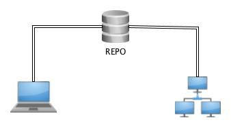]]

---

# Fetch

.center[.middle[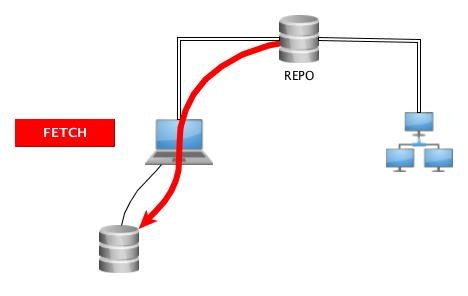]]

---

# Checkout

.center[.middle[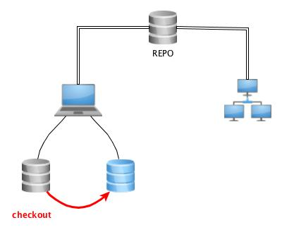]]

---

# Branches

.center[.middle[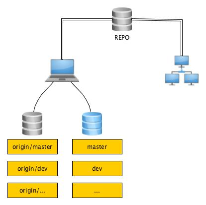]]

---

# Stage en commit (1)

.center[.middle[]]

---

# Stage en commit (2)

.center[.middle[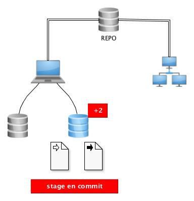]]

---

# Commit van teamleden

.center[.middle[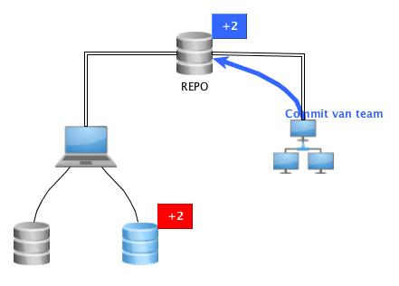]]

---

# Fetch

.center[.middle[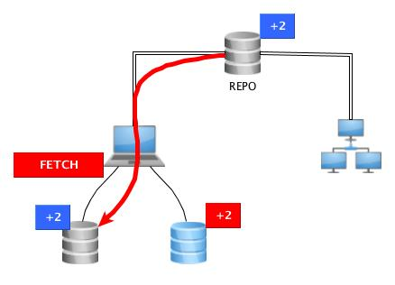]]

---

# Merge

.center[.middle[]]

---

# Push

.center[.middle[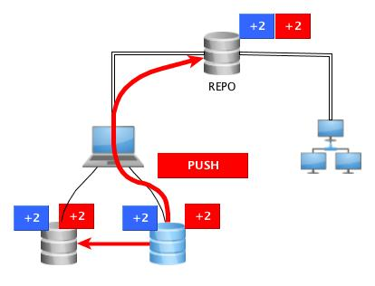]]

---

# Remotes- Origin: schrijfrechten

.center[.middle[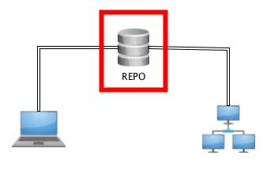]]

---

# Remotes- Upstream: leesrechten

.center[.middle[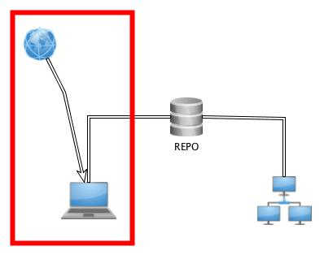]]

---

# Github: fork en pull request

.center[.middle[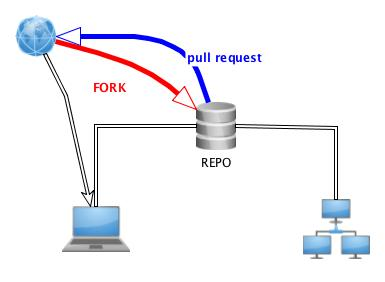]]

???

Dit was het overzicht van de verschillende termen en werkwijze: nu meer over de achterliggende techniek

---

class: center, middle

# Techniek

---

# Terminologie (a.k.a. talk the talk)

- branch (master, gh-pages, dev, release, hotfix)
- commit (sha)
- pull and push (origin, upstream)
- merge (cherrypick)
- remotes (distributed)
- tag
- log
- blame

---

# Branch

*Zelfde code, maar net even anders...*

- Gescheiden houden van OTAP straat.
- Snel en makkelijk schakelen (bijv. van implementatie feature naar bugfix)
- "Even wat uitproberen" zonder schade toe te brengen

---

# Commit

Kleinste, zelfstandige verandering

- werkende functie
- fix typo
- werkende unit-test

Commit: wegschrijven van de delta's ten opzichte van de vorige commit (dus ook verwijderen is toevoegen).

Elke commit krijgt een unieke sha (handig als referentie).

Denk ook aan het schrijven van een goede commit-message.

---

# Sha

.middle[.center[]]

.footnote[Cartoon van: <a href="http://geek-and-poke.com/geekandpoke/2013/12/26/games-for-the-real-geeks">Geek and poke</a>, Creative Commons Licentie]

---

# Commit message

1e regel: Header / samenvatting

2e regel: Leeg

-e regel: Beschrijvende tekst

Schrijf een zinvolle commit-message (je bent jezelf later dankbaar).

---

# Commit message

.middle[.center[]]

.footnote[Cartoon: <a href="https://xkcd.com/1296/">xkcd</a>: Creative Commons Licentie]

---

# Vóór de commit

`git diff <file>` -- toont de wijzigingen in die file sinds de laatste commit

Voor wijzigingen in de hele repo:

    git status

---

# Push en pull

- Pull: geef mij de laatste versie van de repo en merge met mijn versie
- Push: mijn versie wegschrijven naar de server

Push alleen OK als gebasseerd op de laatste versie

???

Push: git checkt of de delta is tov de sha op server

Is server nieuwer? Dan eerst pull en een local merge doorvoeren.

Merge? -->

---

# Merge

Het samenvoegen van twee branches:
- bugfix in prod
- feature branch in dev

Maar ook:
- remote met locale versie

Let op: merge conflits

---

# Cherrypick

TODO: leuk plaatje

"Ik vind die ene commit in die andere branch wel leuk, maar de rest hoeft ik niet."

---

# Rebase / Squash

Please don't

--

Zoek de gemeenschappelijke voorouder en pas de delta's van de ene branch toe op de andere.

---

# Tag

Als je door alle commits de bomen in het bos niet meer ziet: hang er een label aan.

Gebruik voor:
- aanwijzen release
- opgeven versienummer (git describe)

---

# Log

Geeft een overzicht van alle commits.

Opties:
- alle branches
- oneline of gehele commit-message
- grafiek

---

# Blame

Niet zo zeer om de schuld af te schuiven, maar wel goed om te achterhalen wie wat wanneer heeft gedaan.
---

class: center, middle

# Workflow

---

# Vanaf begin

1. git init
2. add .gitignore
3. bestanden toevoegen
4. git add .
5. git commit
6. [repeat]
7. git push
8. branch, merge, ...
9. tag
10. release

---

class: center, middle

# Cloud

---

# Voordelen

- open (als je wilt)
- delen
- samenwerken
- commit-hooks
- online editing
- issues en tickets
- overzicht branches, commits, merges

- readthedocs, gitbook

---

# Hosts

GitHub:
- www.github.com
- gh-pages
- erg populair

Bitbucket:
- www.bitbucket.com
- JIRA
- private repositories

GitLab:
- www.gitlab.com
- GitLab CE: open source
- host your own

...

---

class: center, middle

# Extra's

---

# Kanban / Scrum

- Visualiseer
- Deel met anderen
- Feedback

- backlog -> todo -> in progress -> test -> done
- In de cloud: vaak ingebouwd

---

# Issuetracker

- issues, bugs, wensen
- discussies

---

# Bugs

- wat gaat er precies mis
- wat is het verwachte resultaat, wat is het daadwerkelijke resultaat
- welke versie (en welke versie van OS, libraries, ...)
- minimale stappen om het te reproduceren
- foutmeldingen / logbestanden

---

class: center, middle

# GEO

---

# Git en GEO

- Git is niet super met binary files --> geen shapes

--

- Wél met tekstbestanden - WKT, GML, GeoJSON

--

- Alternatief: GeoGig: shp, geojson, geopkg, sl, sqlserver, oracle

---

# Github

Github ondersteunt geojson (WGS84) via leaflet en OSM ondergrond.

.center[.middle[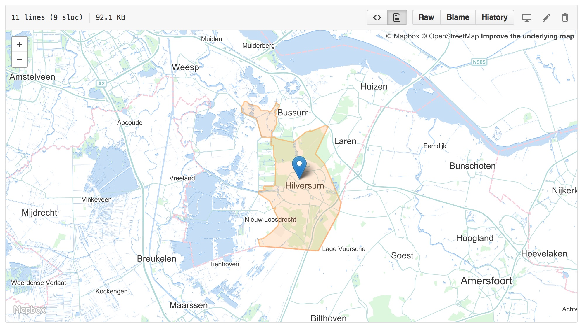]]

---

class: center, middle

# Aan de slag

---

# Hands on (a.k.a walk the walk)

1. Installeer GIT
2. Clone een repo (deze ?)
3. Doe een aanpassing
4. Commit
5. Creeer een branch
6. Doe een aanpassing + commit
7. Merge

---

# Overzicht commando's

.middle[.center[]]

.middle[.footnote[Cartoon van: <a href="https://xkcd.com/1597/">xkcd</a>, Creative Commons Licentie]]

---

# Overzicht commando's (1)

`fetch` - haal de laatste wijzigingen op

`merge` - voeg samen met ...

`pull` - `fetch` + `merge`

`push` - zet wijzigingen door naar de host repo

`clone` - dowload repo

`init` - begin een nieuwe repo

`add` - voeg bestanden toe aan de repo

`commit` - voeg wijzigingen toe aan de repo

`checkout` - ga naar deze branch

`checkout -b` - creeër een nieuwe branch + checkout

---

# Overzicht commando's (2)

`tag <<tag>>` - voeg een tag toe

`stash` - zet mijn wijzigingen even tijdelijk opzij

`pop` - zet mijn wijzigingen weer terug

`log` - toon de geschiedenis

`log --all --graph --oneline` - toon alle wijzigingen in een grafiekformaat

`blame <<file>>` - wie heeft welke regel gesschreven

`show <<sha>>` - laat de commit message zien

`status` - geef een status overzicht`
