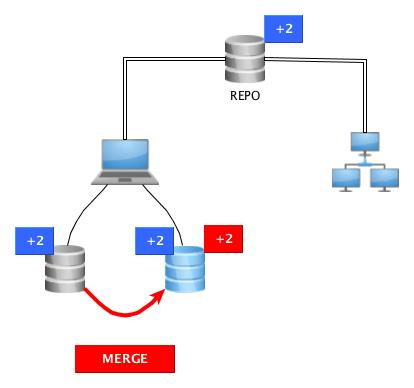

name: titleslide
class: center, middle

# GIT en GitHub voor GEO

Rob van Loon

@rob_vl // http://github.com/borrob

---

# Inhoud

- Wie ?
- Wat ?
- Waarom ?
- Hoe ?

.footnote[Cartoon van: <a href="https://xkcd.com/1597/">xkcd</a>, Creative Commons Licentie]

---

# Wie ?

Wie ben ik ?

*TODO: voeg foto toe en een paar keywords over mijzelf*

--

Wie zijn jullie ?

- Voorstelronde

---

# Wat?

Wat gaan we in deze cursus doen?

--

- GIT
- GIT als versiebeheersysteem
- GIT als code delen *(of meer dan alleen code)* <-- zoals deze curus
- GIT om een bijdrage te leveren
	* code
	* tickets en bugreports
- GIT & GEO
- Aan de slag!

## Wat kun je dan straks?

- je hebt een idee over GIT
- je bent niet meer bang om het te gebruiken
- je weet waarvoor en hoe je GIT kunt gebruiken

---

# Waarom ?

.middle[.center[]]

.footnote[Cartoon van: <a href="http://geek-and-poke.com/geekandpoke/2012/11/3/simply-explained.html">Geek and poke</a>, Creative Commons Licentie]

---

# Wat ? - Wat is GIT ?

Versiebeheer

- bijhouden geschiedenis
- geschiedenis: wie heeft wat gedaan

--

commit

- kleinste, logische eenheid

--

branche

- verschillende versies van hetzelfde
- samenstellen releases

--

samenwerken

- gedistribueerd systeem
- groei van de code

---

# Voor wat ?

- source code

--

- setup scripts

--

- data conversies

--

- documenten

--

- boeken

--

    - [gitbook](https://www.gitbook.com)
    - [Read the docs](https://readthedocs.org)

---

# Alternatieven ?

- losse directories
- Mercurial, Subversion
- Source Safe, Team Foundation

???

De losse directories zijn natuurlijk meest gebruikt, maar ...

---

Alternatieven ?

.middle[.center[]]

.footnote[Cartoon van: <a href="http://www.commitstrip.com/en/2013/11/05/git-svn-ou/">Commitstrip</a>]

---

# REPO

**Waar zit ik de code neer ? **

- lokaal
- gedeelde netwerkschijf
- GitHub
- GitLab
- Bitbucket
- codeCorner

---

# Gedistribueerd versiebeheer

- Repo
- Lokaal
- Push and pull

---

# Repo

.center[.middle[]]

???

Repository op een centrale plek waar iedereen erbij kan (die erbij moet kunnen).
Jij en collega's kunnen lezen en schrijven (pull en push)

---

# Fetch

.center[.middle[]]

???

Fetch: download een kopie van de repo naar je lokale PC

---

# Checkout

.center[.middle[]]

???

Maak een lokale werkkopie

---

# Branches

.center[.middle[]]

???

Later meer, maar zie het als verschillende versies naast elkaar (OTAP)

---

# Stage en commit (1)

.center[.middle[]]

???

Stage: klaar zetten om te committen

Commit: Verandering opslaan

---

# Stage en commit (2)

.center[.middle[]]

???

Niet alles hoeft in 1 commit

---

# Commit van teamleden

.center[.middle[]]

???

Teamladen werken ook gewoon door en publiceren nieuwe code

---

# Fetch

.center[.middle[]]

???

Voordat onze wijzigingen opgeslagen kunnen worden: eerst nieuwe items dowloaden

---

# Merge

.center[.middle[]]

???

Nieuwe items komen in de origin/... terecht. Dus die moeten we ook naar onze werkdirectory kopieren

---

# Push

.center[.middle[]]

???

Push: publiceer

---

# Remotes- Origin: schrijfrechten

.center[.middle[]]

???

Origin is de standaard naam voor de repo

---

# Remotes- Upstream: leesrechten

.center[.middle[]]

???

Github: fork een repo en voeg hem daarna toe als upstream
Op die manier kunnen alle wijzigingen die anderen aanbrengen makkelijk doorgevoerd worden.
En kun je makkelijk een pull-request sturen. [**brug naar volgende slide**]

---

# Github: fork en pull request

.center[.middle[]]

???

Dit was het overzicht van de verschillende termen en werkwijze: nu meer over de achterliggende techniek
Verschillende termen misschien nog wat onduidelijk

---

class: center, middle

# Techniek

---

# Terminologie (a.k.a. talk the talk)

- branch (master, gh-pages, dev, release, hotfix)
- commit (sha)
- pull and push (origin, upstream)
- merge (cherrypick)
- remotes (distributed)
- tag
- log
- blame

???

Kort overzicht: gaan we stap voor stap doornemen

---

# Branch

*Zelfde code, maar net even anders...*

- Gescheiden houden van OTAP straat.
- Snel en makkelijk schakelen (bijv. van implementatie feature naar bugfix)
- "Even wat uitproberen" zonder schade toe te brengen

---

# Commit

Kleinste, zelfstandige verandering

- werkende functie
- fix typo
- werkende unit-test

Commit: wegschrijven van de delta's ten opzichte van de vorige commit (dus ook verwijderen is toevoegen).

Elke commit krijgt een unieke sha (handig als referentie).

Denk ook aan het schrijven van een goede commit-message.

???

Elke commit krijgt een unieke code: de sha. Goede referentie!

---

# Sha

.middle[.center[]]

.footnote[Cartoon van: <a href="http://geek-and-poke.com/geekandpoke/2013/12/26/games-for-the-real-geeks">Geek and poke</a>, Creative Commons Licentie]

???

Maar de eerste 6 karaakters zijn vaak al goed genoeg

---

# Commit message

1e regel: Header / samenvatting

2e regel: Leeg

-e regel: Beschrijvende tekst

Schrijf een zinvolle commit-message (je bent jezelf later dankbaar).

???

Goede commitmessage, want... [next slide]

---

# Commit message

.middle[.center[]]

.footnote[Cartoon: <a href="https://xkcd.com/1296/">xkcd</a>: Creative Commons Licentie]

---

# Vóór de commit

`git diff <file>` -- toont de wijzigingen in die file sinds de laatste commit

Voor wijzigingen in de hele repo:

    git status

???

Wijzigingen zien

---

# Push en pull

- Pull: geef mij de laatste versie van de repo en merge met mijn versie
- Push: mijn versie wegschrijven naar de server

Push alleen OK als gebasseerd op de laatste versie

???

Push: git checkt of de delta is tov de sha op server

Is server nieuwer? Dan eerst pull en een local merge doorvoeren.

Merge? -->

---

# Merge

Het samenvoegen van twee branches:
- bugfix in prod
- feature branch in dev

Maar ook:
- remote met locale versie

Let op: merge conflits

???

Merge al eerder gezien (bij binnenhalen wijzigingen van teamleden)

Merge conflicts aangeduid met <<<<< en >>>>>

---

# Cherrypick

TODO: leuk plaatje

"Ik vind die ene commit in die andere branch wel leuk, maar de rest hoeft ik niet."

---

# Rebase / Squash

Zoek de gemeenschappelijke voorouder en pas de delta's van de ene branch toe op de andere.

--

Please don't

???

Waarom niet doen? Je verliest hier een overzicht en het is lastig om terug te vinden wat uit welke branch kwam

---

# Tag

Als je door alle commits de bomen in het bos niet meer ziet: hang er een label aan.

Gebruik voor:
- aanwijzen release
- opgeven versienummer (git describe)

---

# Log

Geeft een overzicht van alle commits.

Opties:
- alle branches
- oneline of gehele commit-message
- grafiek

---

# Blame

Niet zo zeer om de schuld af te schuiven, maar wel goed om te achterhalen wie wat wanneer heeft gedaan.

???

Erg handig: wie heeft wat en wanneer verandert?

---

class: center, middle

# Workflow

---

# Vanaf begin

1. git init
2. add .gitignore
3. bestanden toevoegen
4. git add .
5. git commit
6. [repeat]
7. git push
8. branch, merge, ...
9. tag
10. release

---

class: center, middle

# Cloud

---

# Voordelen

- open (als je wilt)
- delen
- samenwerken
- commit-hooks
- online editing
- issues en tickets
- overzicht branches, commits, merges

- readthedocs, gitbook

---

# Hosts

GitHub:
- www.github.com
- gh-pages
- erg populair

Bitbucket:
- www.bitbucket.com
- JIRA
- private repositories

GitLab:
- www.gitlab.com
- GitLab CE: open source
- host your own

...

---

class: center, middle

# Extra's

---

# Kanban / Scrum

- Visualiseer
- Deel met anderen
- Feedback

- backlog -> todo -> in progress -> test -> done
- In de cloud: vaak ingebouwd

???

Makkelijk: tickets kunnen verwijzen naar commit en vv.
Zeker scrum: goed versiebeheer nodig

---

# Issuetracker

- issues, bugs, wensen
- discussies

???

Voor de cloudomgeving: ook hier makkelijk verwijzen naar commits

---

# Bugs

- wat gaat er precies mis
- wat is het verwachte resultaat, wat is het daadwerkelijke resultaat
- welke versie (en welke versie van OS, libraries, ...)
- minimale stappen om het te reproduceren
- foutmeldingen / logbestanden

---

class: center, middle

# GEO

---

# Git en GEO

- Git is niet super met binary files --> geen shapes

--

- Wél met tekstbestanden - WKT, GML, GeoJSON

--

- Alternatief: GeoGig: shp, geojson, geopkg, sl, sqlserver, oracle

???

Persoonlijk heb ik geen ervaring met geogig. Het schijnt best goed te werken (ken alleen goede verhalen).

---

# Github

Github ondersteunt geojson (WGS84) via leaflet en OSM ondergrond.

.center[.middle[]]

???

Elke geojson wordt op github standaard als kaart afgebeeld.

---

class: center, middle

# Aan de slag

---

# Hands on (a.k.a walk the walk)

1. Installeer GIT
2. Clone een repo (deze ?)
3. Doe een aanpassing
4. Commit
5. Creeer een branch
6. Doe een aanpassing + commit
7. Merge

???

Nu zelf aan de slag.
TODO: hoe pakken we dit handig aa?

---

# Overzicht commando's

.middle[.center[]]

.middle[.footnote[Cartoon van: <a href="https://xkcd.com/1597/">xkcd</a>, Creative Commons Licentie]]

---

# Overzicht commando's (1)

`fetch` - haal de laatste wijzigingen op

`merge` - voeg samen met ...

`pull` - `fetch` + `merge`

`push` - zet wijzigingen door naar de host repo

`clone` - dowload repo

`init` - begin een nieuwe repo

`add` - voeg bestanden toe aan de repo

`commit` - voeg wijzigingen toe aan de repo

`checkout` - ga naar deze branch

`checkout -b` - creeër een nieuwe branch + checkout

---

# Overzicht commando's (2)

`tag <<tag>>` - voeg een tag toe

`stash` - zet mijn wijzigingen even tijdelijk opzij

`pop` - zet mijn wijzigingen weer terug

`log` - toon de geschiedenis

`log --all --graph --oneline` - toon alle wijzigingen in een grafiekformaat

`blame <<file>>` - wie heeft welke regel gesschreven

`show <<sha>>` - laat de commit message zien

`status` - geef een status overzicht`
